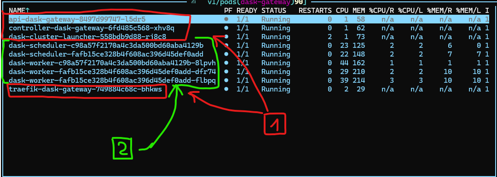
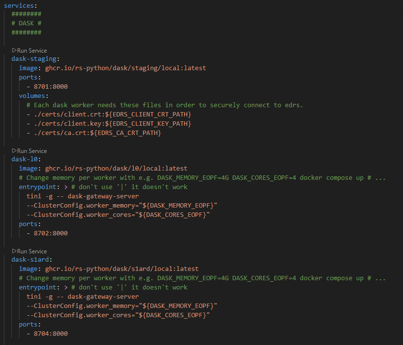

# Dask images in RS-Python

Dask is the library used in RS-Python to manage parallel computing of resource-intensive task. Currently, these tasks are the staging ones and all the processor executions. In order to use Dask for these elements, we need to build specific Docker images that contain the expected Dask Python dependency for each element and in each context. This leads to a fairly large amount of Dask images being used across the project, with adaptations whether we are in a regular cluster environment or a local environment for tests, and whether their usage is for staging tasks or running EOPF processors. This documentation aims to clarify the current architecture for these Dask images and their use cases.

## Overall architecture

### For cluster mode

Cluster mode is the expected running mode of the RS-Python system, and so is used as the reference architecture for the Dask images. The cluster mode features a Dask server deployed through Helm charts, allowing to deploy a Dask image with minimal dependencies inside, as only the Dask Python library to communicate with the Dask server is needed. All Dask images suited for cluster mode are suffixed with "k8s" (for example, *ghcr.io/rs-python/dask/l0/k8s*), but those images ONLY work in cluster mode.

The screenshot above shows the current Dask architecture in a real cluster. The Dask server is labelled as 1, it is deployed once and contains everything needed to deploy Dask clusters, labelled as 2. Here, there are two Dask clusters deployed, and each one of them is created from a Docker image such as `ghcr.io/rs-python/dask/l0/k8s`. The Dask clusters contain a scheduler and several workers and are created, scaled and removed on user's demand, while the server is always active and maintained by the administrator.

### For local mode

Local mode is the lightweight environment used for tests on a local computer, for development purposes only. This environment is deployed through docker-compose, that doesn't allow the use of Helm chart, which makes the Dask architecture in local mode different than the one in a real Kubernetes cluster. For this reason, there is no access to a centralized Dask server in local mode, and each Dask image deployed in local mode needs to include its own Dask server, through a dependency to "dask-gateway-server" that doesn't exist in the cluster mode images. All Dask images suited for local mode are suffixed with "local" (for example, `ghcr.io/rs-python/dask/l0/local`), and while in theory they are supposed to work in cluster mode as well, they are created for development purposes only and for the docker-compose local mode specifically.

This screenshot is an example of how the Dask images are deployed in local mode. The important thing to notice is that each service is deployed independently to the other ones. There is no central server like in cluster mode, and each image used acts as its own Dask server deploying itself as a Dask cluster.

## Base images

The Dask images are built in two steps: first the base images, then the processors and staging images from these base images. The base images contain the common elements between processors and staging.

The base images can be tuned on three different parameters: the target system (local or k8s), the Python version and the Dask version. Currently, besides the target systems, there are differences in the Python and Dask versions needed for the processors and the ones needed for the staging.

All the files needed to build the base images are located in the [*rs-workflow-env* repository](https://github.com/RS-PYTHON/rs-workflow-env), in the *docker/base* subfolder. This subfolder contains the Dockerfiles for the two kinds of base Dask images (local and k8s), along with Dockerfiles for Jupyter and Python base images (that are not linked to Dask images) and a script to generate them. The repository's CI is in charge of building the official base images used in the real deployments.

Each base image contains a Jupyter environment with the libraries "dask", "distributed" and "dask-gateway". The local base image also contains the library "dask-gateway-server" that is ran as an entrypoint to start the Dask server in local mode. The version of "dask-gateway" and "dask-gateway-server" is the same everywhere, is regularly updated and is not linked to the version of the other dependencies (for information "dask" and "distributed" libraries use the same version).

Currently, here are the four variants of Dask base images created and their usage. The tag follows the naming convention `<TARGET SYSTEM>-py<PYTHON VERSION>-<DASK VERSION>`.

- `ghcr.io/rs-python/dask/dask-gateway:k8s-py3.13.12-2026.1.2`: for staging on cluster mode. The staging runs with Python 3.13.12 and usually the latest version of Dask as it has a direct dependency to it that can be updated regularly.
- `ghcr.io/rs-python/dask/dask-gateway:k8s-py3.11.7-2024.5.2`: for processors on cluster mode. The processors are currently in Python 3.11.7 and their dependency to Dask is more complicated to update as it is linked to a third-party dependency, so it uses an older version.
- `ghcr.io/rs-python/dask/dask-gateway:local-py3.13.12-2026.1.2`: for staging on local mode.
- `ghcr.io/rs-python/dask/dask-gateway:local-py3.11.7-2024.5.2`: for processors on local mode.

## Processor images

The Dask Docker images embedding the processors are built from the two base images described in the previous section. For each processor, two images are built, one for the cluster mode and one for the local mode. Along with the regular processor images, each processor can be built as a "localcluster" image, which is a more specific image based on the *rs-dpr-service* image, created for detailed debugging in local mode. This image is tied to *rs-dpr-service* and will not be detailed here.

All the files needed to build the base images are located in the [*rs-workflow-env* repository](https://github.com/RS-PYTHON/rs-workflow-env), in the *docker/eopf* subfolder. Along with the *Dockerfile.dask-eopf* file for the regular processors, the *Dockerfile.dask-eopf-localcluster* is for the localcluster mode described here and the *Dockerfile.dask-eopf-mockup* is for the mockup of the processor that has its own specificities.

Currently, the processors supported are **L0**, **S1ARD** and the mockup processor. Each processor is installed thanks to a *requirements* file located in the *resources* subfolder.

## Staging images

The staging images, one for the cluster mode and one for the local mode, are built from the two base images described in the previous section. The Dockerfile used is located in the [*rs-server* repository](https://github.com/RS-PYTHON/rs-server), in the *services/staging/.github* subfolder (specifically [here](https://github.com/RS-PYTHON/rs-server/blob/develop/services/staging/.github/Dockerfile.dask-staging)). The CI of rs-server is in charge of building the Docker images for dask-staging.

## Integration with test environment

Besides the differences between the images used in cluster mode and the ones used in local mode, another difficulty with the existing system is the inconsistency of the Dask version used between the processors and the staging. This inconsistency creates blocking problems when trying to communicate with Dask clusters using the *rs-demo* notebooks, because the notebook's environment needs to have the same Dask version as the one used in the Dask cluster it is communicating with. For notebooks where we alternate between staging clusters and processor clusters, this is not possible using a single Python environment.

To solve this problem, the Jupyter image built for demos now embeds a second virtual environment, specifically for dask-staging clusters. This environment is created in the Jupyter base image in the *rs-workflow-env* repository ([here](https://github.com/RS-PYTHON/rs-workflow-env/blob/develop/docker/base/Dockerfile.jupyter)). In the [*rs-demo* repository](https://github.com/RS-PYTHON/rs-demo), the script to spawn and scale a dask-staging cluster (located in subfolder *notebooks/resources*) is ran as a subprocess inside the second virtual environment to be able to use the correct version of Dask. The impact for the end user is minimal (the main difference is that the function is asynchronous), and for more technical informations on how it is done please check the comments and the documentation inside the [*dask_utils.py* file](https://github.com/RS-PYTHON/rs-demo/blob/develop/notebooks/resources/dask_utils.py).
